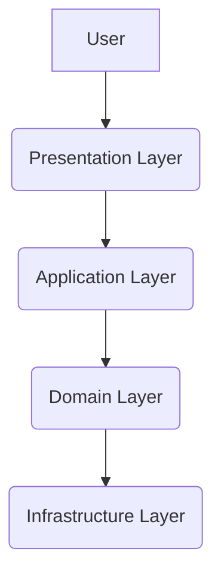

# Python Clean Architecture Boilerplate 🐍✨

[](https://github.com/{{username}}/{{repo}}/actions)
[](https://{{username}}.github.io/{{repo}}/)
[](https://github.com/{{username}}/{{repo}}/actions)
[](LICENSE)

A rigorously structured Python boilerplate following Domain-Driven Design (DDD) and Clean Architecture principles. Features full automation of documentation, testing, and CI/CD with modern Python tooling.

## Features ⚡

- **Clean Architecture Implementation**
  - Strict layer separation (Domain, Application, Infrastructure, Presentation)
  - Dependency inversion principle enforcement
  - Type-safe interfaces between layers

- **Modern Toolchain**
  - ⚡ UV-powered dependency management
  - 🚀 FastAPI for web endpoints
  - ✅ Strict type checking with Mypy
  - 🧹 Code formatting with Ruff
  - 📜 Automated docstrings and MkDocs documentation

- **Full Automation**
  - GitHub Actions CI/CD pipelines
  - Pre-commit hooks for code quality
  - Automated API documentation
  - BDD testing with pytest-bdd
  - Mermaid/PlantUML diagram support

## Quick Start 🚀

### Prerequisites
- Python 3.10+
- [UV](https://github.com/astral-sh/uv)
- Git 2.25+

### Installation
```bash
git clone https://github.com/SPRIME01/Python-Clean-Architecture-Boilerplate.git
cd Python-Clean-Architecture-Boilerplate

# Create virtual environment and install dependencies
uv venv
source .venv/bin/activate  # Windows: .venv\Scripts\activate
uv pip install -e .[dev]

# Install pre-commit hooks
pre-commit install
```

## Usage 📦

### Running the API
```bash
uvicorn src.your_domain.presentation.main:app --reload
```

### Testing
```bash
# Run all tests with coverage
make test

# Run specific test types
pytest tests/unit
pytest tests/integration
pytest tests/bdd
```

### Linting & Formatting
```bash
make lint  # Runs Ruff, Mypy, Yamllint, and docstring checks

# Auto-fix linting issues
ruff check --fix src
```

### Documentation
```bash
# Serve docs locally
make docs

# Generate new docstrings
docstring-gen --style=google --input=src/
```

## Project Structure 🌳

```text
src/
├── your_domain/
│   ├── domain/          # Pure business logic
│   ├── application/     # Use cases and interfaces
│   ├── infrastructure/  # External implementations
│   └── presentation/    # FastAPI endpoints
tests/
├── unit/                # Isolated component tests
├── integration/         # Cross-component tests
└── bdd/                 # Behavior-driven tests
docs/                    # MkDocs documentation
.github/
└── workflows/           # CI/CD pipelines
```

## Documentation 📚

Our documentation system features:
- Auto-generated API reference
- Mermaid/PlantUML diagram support
- Type-aware docstrings
- Versioned documentation

Write documentation in Markdown files under `docs/`. Diagrams are stored as text files in `docs/diagrams/`.



## Contributing 🤝

1. Fork the repository
2. Create feature branch (`git checkout -b feature/amazing-feature`)
3. Commit changes (`git commit -m 'Add amazing feature'`)
4. Push to branch (`git push origin feature/amazing-feature`)
5. Open Pull Request

See [CONTRIBUTING.md](CONTRIBUTING.md) for detailed guidelines.

## License 📄

This project is licensed under the MIT License - see the [LICENSE](LICENSE) file for details.

---

**Happy Coding!** 🚀 Built with ❤️ following Clean Architecture principles
